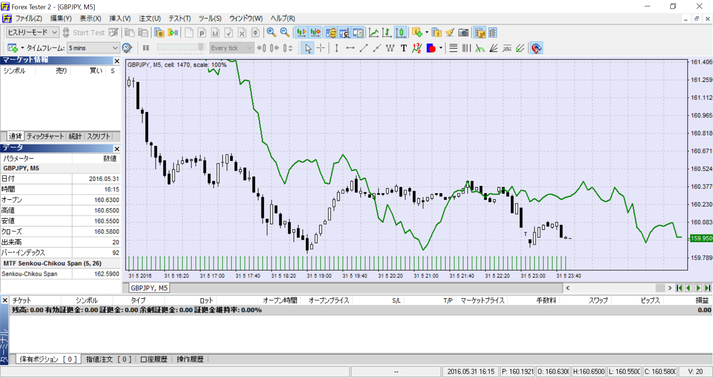

# WL_MTF_SenkouChikouSpan
マルチタイムフレーム先行遅行スパン インジケータ
Forex Tester 2 用

## 概要
一目均衡表の遅行スパンを、先行スパンのようにローソク足26本ぶん先行させたものです。  
マルチタイムフレーム対応です。

## 動作環境
Forex Tester 2 

## ビルド
ビルドのためには、Forex Tester 2 付属の以下のファイルが必要になります。

* TechnicalFunctions.h
* IndicatorInterfaceUnit.h

# スクリーンショット
 